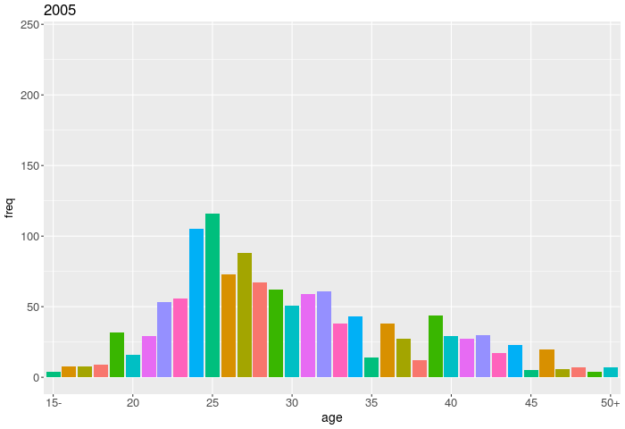

# Parse Wikipedia

## 概要
女性声優の年齢別人口分布の調査。
オタク特有のアニメで新しく知るキャストを調べる、という行動を繰り返すうち、
「特定の世代に年齢集中してない?」と思ったのがきっかけ。
この疑問を解決するため、何年生まれに声優がどれほど集中しているか調査することにした。

調査には Wikipedia を利用。芸能人の出演作品が几帳面にまとめられているサイトである。
データの信頼性は保証されないが、正確な数値を求めたいわけではないし、
それっぽい数値が得られるだけでもありがたい。

今回、[\[Category:日本の女性声優\]](https://ja.wikipedia.org/wiki/Category:%E6%97%A5%E6%9C%AC%E3%81%AE%E5%A5%B3%E6%80%A7%E5%A3%B0%E5%84%AA)
の「テレビアニメ」の出演作品の総本数を、年齢ごとにまとめてグラフにした(記事は多少選別している)。
単に出演本数のみにしたのは、「声優」の定義が困難で、その正確な数を数えるのは困難なため。
それこそ Wikipedia の総記事数を数えてしまうと大変に信用できない結果になる。
所ジョージですら
[日本の男性声優](https://ja.wikipedia.org/wiki/Category:%E6%97%A5%E6%9C%AC%E3%81%AE%E7%94%B7%E6%80%A7%E5%A3%B0%E5%84%AA)
に入っているのだ。

この方法の問題点は「役:少年A」等もカウントされてしまうこと。
そして、年齢を公開していない人物は、無視されてしまうこと。
対して別の利点は多く出演している人ほど影響力が大きくなること。

## 結果


年齢別の総出演作品をまとめたグラフである。
gif画像では、2012,2013年で24歳付近(黄土、茶色)の出演数が跳ね上がっていることが確認できる。
そして、その約6歳下の集団(桃色、紫色)も似たような変化をしている。

## データ

### pages/
wikipedia の記事。数MBある。
wikipedia の記事の再配布は wikipedia から取ってきたこととリンクを明記しておけば
大丈夫だという解釈が正解と信じている。

### perf.csv
記事をパースして解析しやすくしたもの。

## スクリプト

### Makefile
以下のコマンドで、gif画像の生成まで行う。リポジトリには、これを行ったものをアップロードしている。

```
make
```

以下のコマンドで、 make により生成したものを削除する。

```
make clean
```

以下のコマンドで、最新のwikipediaの記事をダウンロードする(1時間かかる)。

```
make download
```

### dlid.py
Wikipediaの [Category:日本の女性声優](https://ja.wikipedia.org/wiki/Category:%E6%97%A5%E6%9C%AC%E3%81%AE%E5%A5%B3%E6%80%A7%E5%A3%B0%E5%84%AA)
に属する記事idを一括ダウンロードする。

生成:pageid.dat

### dlarticle.py
pages/ 以下に、記事を(pageid.datを参照して)一括ダウンロードする。
**1時間以上かかる**。

生成:pages/ pages/*.txt

### selectva.py
ダウンロードした記事(pages/*.txt)のうち、適切なものを選択する。

生成:valist.txt

### parsearticle.py
ダウンロードした記事(pages/*.txt)をパースし、データを抽出する。

生成:perf.csv

### kaiseki.r
年齢別に出演数をまとめたgif画像を生成する。年齢は、その年の4月から翌年の3月までを
同一のものとして数えている。

生成:animation.gif

## 依存パッケージ

### python
すべてpip3で入ったと思う。
* requests
* tqdm

### R
すべて install.packages で入ったと思う。
* ggplot2
* animation


## LISENCE
ディレクトリ pages/ 以下のテキストファイルは全て wikipedia の
ソースの再配布です。各ファイル　.txt の前の番号は記事番号(pageid)
であり、元記事の最新記事は以下のようにして参照できます。
```
http://ja.wikipedia.org/wiki/?curid=記事番号
```